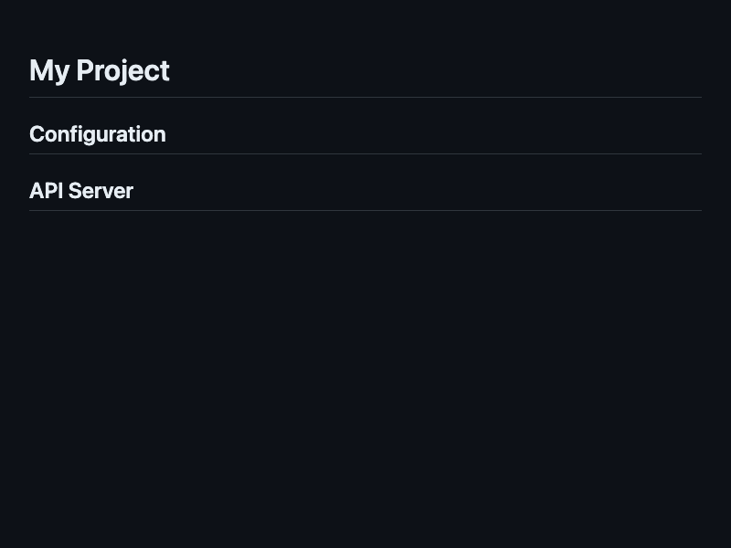
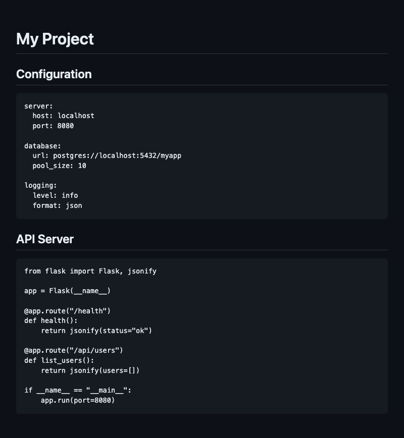

<p align="center">
  <h1 align="center">embed-src</h1>
  <p align="center">
    Embed source files into any text file using comment markers.
    <br /><br />
    <a href="https://github.com/urmzd/embed-src/releases">Download</a>
    &middot;
    <a href="https://github.com/urmzd/embed-src/issues">Report Bug</a>
    &middot;
    <a href="https://github.com/urmzd/embed-src/blob/main/action.yml">GitHub Action</a>
  </p>
</p>

<p align="center">
  <a href="https://github.com/urmzd/embed-src/actions/workflows/ci.yml"></a>
  <a href="https://crates.io/crates/embed-src"></a>
</p>

## Showcase

<table align="center">
  <tr>
    <td align="center"><strong>Before</strong></td>
    <td align="center"><strong>After</strong></td>
  </tr>
  <tr>
    <td align="center"></td>
    <td align="center"></td>
  </tr>
</table>

## Syntax

Place opening and closing markers in your file using whatever comment style is appropriate:

**Markdown / HTML:**
```markdown
<!-- embed-src src="path/to/config.yml" -->
<!-- /embed-src -->
```

**Rust / JS / Go / C:**
```rust
// embed-src src="path/to/utils.py"
// /embed-src
```

**Python / Shell / YAML:**
```python
# embed-src src="path/to/setup.sh"
# /embed-src
```

**CSS:**
```css
/* embed-src src="path/to/theme.css" */
/* /embed-src */
```

**SQL / Lua:**
```sql
-- embed-src src="path/to/schema.sql"
-- /embed-src
```

When the tool runs, the content between the markers is replaced with the referenced file's contents.

### Raw vs Fenced Insertion

By default, content is inserted **raw** (no wrapping). This works for any file type.

To wrap content in markdown code fences, use the `fence` attribute:

| Attribute | Behavior |
|-----------|----------|
| *(none)* | Raw insertion |
| `fence` | Code fence with auto-detected language |
| `fence="auto"` | Code fence with auto-detected language |
| `fence="python"` | Code fence with explicit language tag |

**Example with fencing:**

````markdown
<!-- embed-src src="path/to/config.yml" fence="auto" -->
```yaml
server:
  host: localhost
  port: 8080
```
<!-- /embed-src -->
````

- Paths are relative to the host file's directory.
- The code fence language is inferred from the file extension when using `fence` or `fence="auto"`.
- Re-running is idempotent -- existing content between markers is replaced.

## Features

- **Any File Type**: Embed into markdown, YAML, Python, Rust, or any file with comments.
- **Raw or Fenced**: Insert raw content by default, or wrap in code fences with `fence`.
- **Custom Commit Options**: Personalize commit messages, author details, and push behavior.
- **Dry-Run Mode**: Test embedding without creating commits.
- **Seamless Integration**: Drop into any GitHub Actions workflow.

## Installation

### Script (macOS / Linux)

```sh
curl -fsSL https://raw.githubusercontent.com/urmzd/embed-src/main/install.sh | sh
```

Installs the latest release to `$HOME/.local/bin` and adds it to your shell's `PATH`.

**Options (environment variables):**

| Variable | Description | Default |
|----------|-------------|---------|
| `EMBED_SRC_VERSION` | Version to install (e.g. `v3.1.1`) | latest |
| `EMBED_SRC_INSTALL_DIR` | Installation directory | `$HOME/.local/bin` |

**Example — pin a version:**
```sh
EMBED_SRC_VERSION=v3.1.1 curl -fsSL https://raw.githubusercontent.com/urmzd/embed-src/main/install.sh | sh
```

### Manual

Download a pre-built binary for your platform from the [releases page](https://github.com/urmzd/embed-src/releases/latest) and place it somewhere on your `PATH`.

> **Windows** — the script installer is not supported; use the manual download above.

## Local Usage

The `embed-src` binary can also be used directly:

```bash
# Process files in place
embed-src README.md docs/*.md

# Check if files are up-to-date (CI mode)
embed-src --verify README.md

# Preview changes without writing
embed-src --dry-run README.md
```

## Inputs

| Name | Description | Required | Default |
|------|-------------|----------|---------|
| `files` | Space-separated list of files to process. | No | `README.md` |
| `commit-message` | Commit message for the embedded changes. | No | `chore: embed source files` |
| `commit-name` | Git committer name. | No | `github-actions[bot]` |
| `commit-email` | Git committer email. | No | `github-actions[bot]@users.noreply.github.com` |
| `commit-push` | Whether to push after committing. | No | `true` |
| `commit-dry` | Skip the commit (dry-run mode). | No | `false` |
| `github-token` | GitHub token for downloading the binary. | No | `${{ github.token }}` |

## Usage

### Basic

<!-- embed-src src="example.yml" fence="auto" -->
```yaml
name: "Example"

on: [push]

jobs:
  embed:
    runs-on: ubuntu-latest
    permissions:
      contents: write
    steps:
      - name: "Checkout repo"
        uses: actions/checkout@v4
      - name: "Embed code into files"
        uses: urmzd/embed-src@v3
        with:
          files: "README.md"
```
<!-- /embed-src -->

### Multiple Files

```yaml
- uses: urmzd/embed-src@v3
  with:
    files: "README.md docs/API.md docs/GUIDE.md"
```

### Dry Run (No Commit)

Useful for CI validation -- embed the files and check for drift without committing:

```yaml
- uses: urmzd/embed-src@v3
  with:
    commit-dry: "true"
    commit-push: "false"
```

## Troubleshooting

**Action fails with "nothing to commit"**
This means no changes were needed. Ensure your files contain valid `embed-src` markers with `src="..."` and corresponding `/embed-src` closing markers.

**Permission denied on push**
The action needs `contents: write` permission. Add this to your job:
```yaml
permissions:
  contents: write
```

**Files not being embedded**
Verify the file paths in `files` are relative to the repository root and that the referenced source files exist.

## Agent Skill

This project ships an [Agent Skill](https://github.com/vercel-labs/skills) for use with Claude Code, Cursor, and other compatible agents.

Available as portable agent skills in [`skills/`](skills/).

Once installed, use `/embed-src` to embed source files into documents using comment markers.

## Internal Use

We use Embed Src in our own CI/CD pipelines, ensuring our documentation is always synchronized with the latest code.
